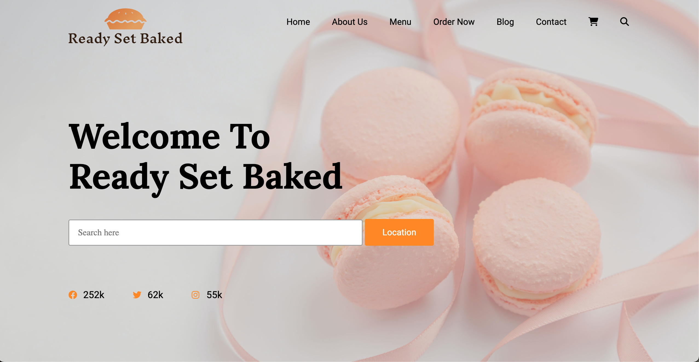

# Ready Set Baked
Static mock website for bakery

**Link to project:** http://recruiters-love-seeing-live-demos.com/

## How It's Made:

**Tech used:** HTML, CSS

Built a basic informational website for a bakery. Really got to play around with some CSS and HTML. Added styles and responsiveness for different screen sizes. 

## Lessons Learned:

Had to play around with the media queries for responsiveness in CSS. Started with full screen and had to work down. Instead of chasing screen sizes I decided to go with adjusting the site as needed for looks, so sizing breaks are implemented as needed for the overall look of the site. I had to make descisions on what can stay or go as the screen got smaller, was the content worth keeping if it didn't flow right?
